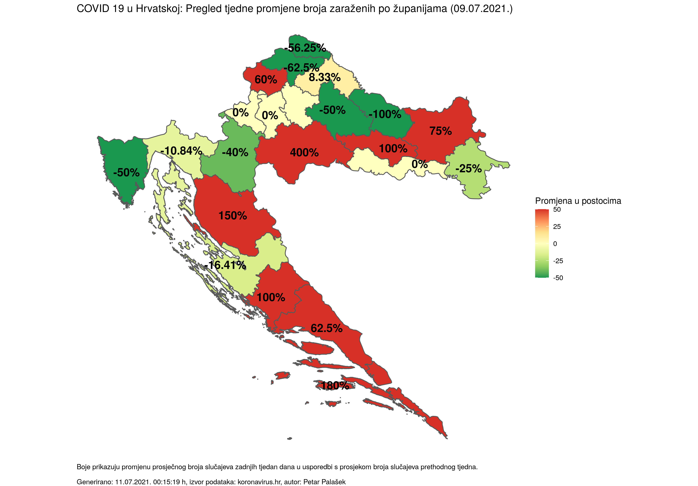
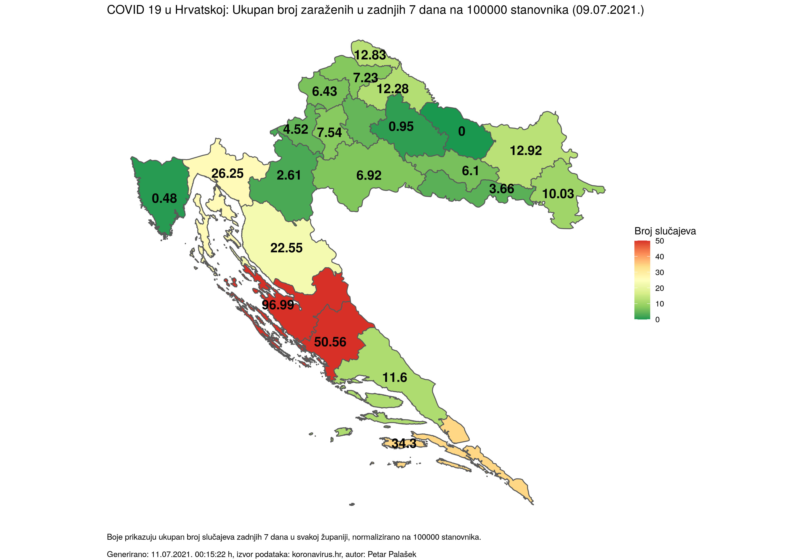
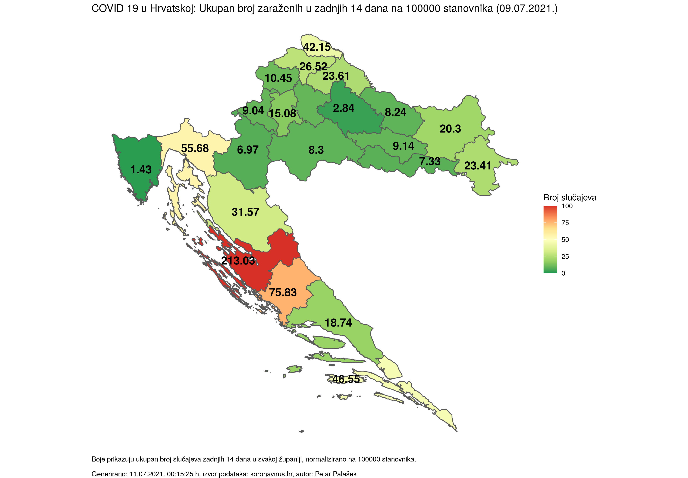
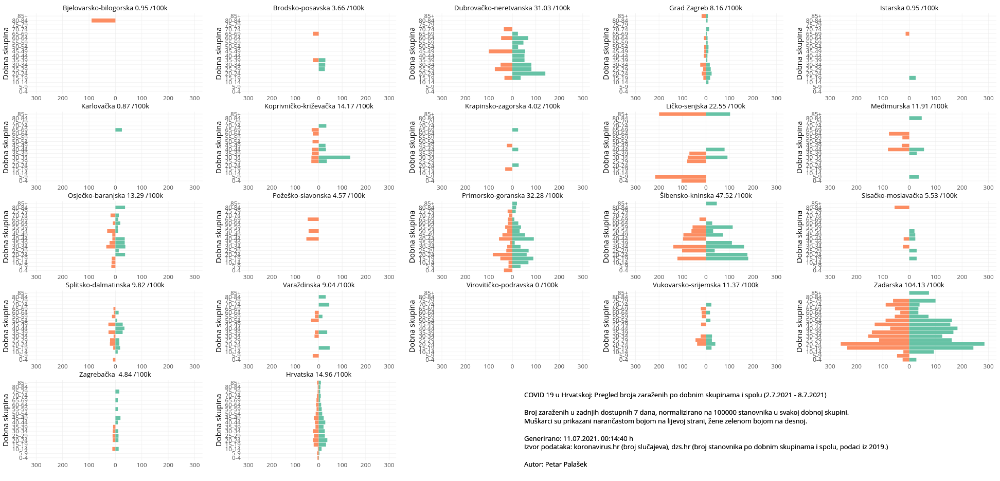

This repository contains the code used for generating plots tracking the progress of COVID-19 cases in Croatia displayed on [ppalasek.github.io](https://ppalasek.github.io/).

Example plots are shown below.

